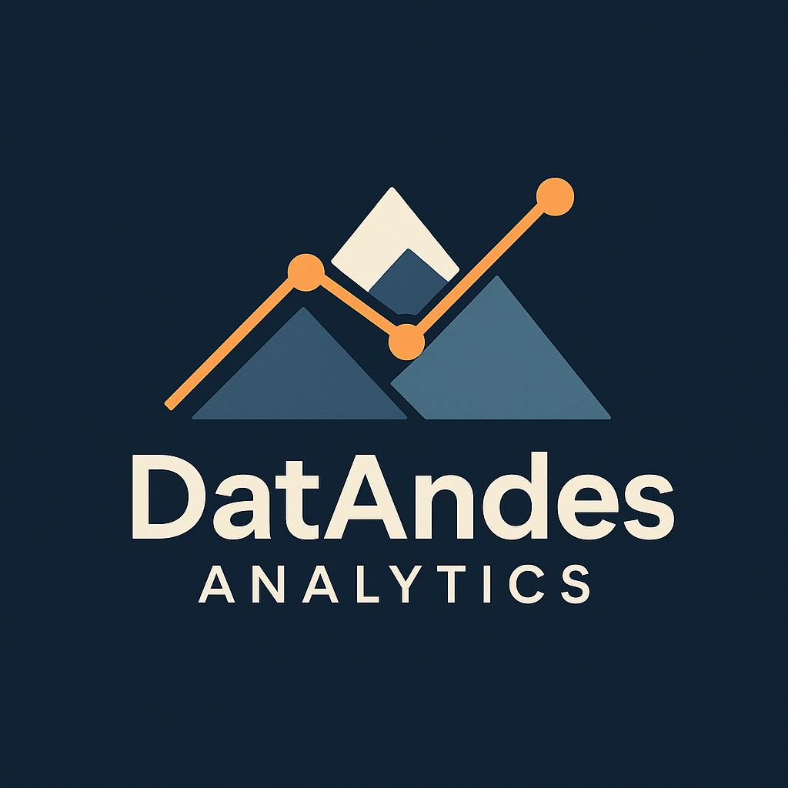

# 🗻 DatAndes Analytics



1. **Misión**: Transformamos datos en decisiones estratégicas para industrias, gobiernos y empresas, usando ciencia de datos con enfoque humano y regional.

2. **Visión**: Ser la firma de análisis de datos líder en Latinoamérica para sectores económicos y sociales, destacándonos por impacto, innovación y ética.

---

## 🦅 Inkadata Economico

*Datos que impulsan decisiones*

**Inkadata Económico** analiza bases de datos del **DANE** y otras **fuentes públicas** para generar **insights** sobre la **economía colombiana**. El proyecto incluye `scraping`, `limpieza`, `visualización` y `conclusiones estadísticas` rigurosas.

---

## 📌 Contenido

- [👨🏻‍🎓 Licencias](#-Licencias)
- [🏭 Dominio del Proyecto](#-dominio-del-proyecto)
- [🎯 Objetivos](#-objetivos)
- [🗂️ Estructura del Proyecto](#️-estructura-del-proyecto)
- [🚀 Primeros Pasos](#-Primeros-Pasos)
- []()
- [🎨 Paleta de colores DatAndes](#-Paleta-de-colores-DatAndes)
- [🧑‍🤝‍🧑 Stakeholders del Proyecto](#-Stakeholders-del-Proyecto)
- [📬 Contacto](#-contacto)

---

## 👨🏻‍🎓 Licencias

[](LICENSE)
[](https://www.python.org/)
[]()
[]()

---

## 🏭 Dominio del Proyecto

Inkadata Económico se centra en el análisis estructurado de datos económicos oficiales del DANE relacionados con:

- 🔩 Actividad industrial y manufacturera (EAM)
- 🛍️ Comercio y consumo
- 👩‍🏭 Ocupación laboral y género
- 🚚 Importaciones y producción nacional
- 💰 Costos empresariales y variaciones interanuales

>*Todos los análisis son reproducibles, enfocados en comparar evolución económica y generar escenarios interpretables por sector, empresa o interés ciudadano. Las fuentes provienen de microdatos abiertos y están documentadas.*

---

## 🎯 Objetivos

El **objetivo principal** es identificar patrones económicos y contrastar los años **2016**, **2019** y **2022**, generando dashboards y estadísticas que impulsen la toma de decisiones en el contexto macroeconómico colombiano.

---

## 🗂️ Estructura del Proyecto

```bash

```

---

## 🚀 Primeros Pasos

### 1. Clona este repositorio.

```bash
git clone https://github.com/ImCamilo2103/Inkadata.git
cd Inkadata
```

### 2. Crea un entorno virtual e instala las dependencias

```bash
python -m venv venv
source venv/bin/activate  # En Windows: venv\Scripts\activate
pip install -r requirements.txt
```

### 3. Ejecuta los scripts en orden lógico

```bash
python  scripts/01_web_scraping.py
python  scripts/02_ws_archivos_independienets.py
Python  scripts/03_extraccion_link_descarga.py
python  scripts/04_descarga_dataset.py
```

---

### 🎨 Paleta de colores DatAndes

- `#1B263B` – Azul oscuro profesional  
- `#415A77` – Azul acero
- `#778DA9` – Gris azulado
- `#E0E1DD` – Blanco grisáceo
- `#F4A261` – Naranja suave

---

### 🧑‍🤝‍🧑 Stakeholders del Proyecto

- **Usuarios de datos económicos**: periodistas, economistas, estudiantes.
- **Empresas privadas**: análisis sectorial o de mercado.
- **ONGs y centros de investigación**: estudios sobre empleo, informalidad, etc.
- **Ciudadanía curiosa**: personas interesadas en entender su país con datos.

*Nota:* DatAndes es una empresa apolítica. Este proyecto tiene fines educativos y de libre análisis.

---

## 📬 Contacto

Desarrollado por **Camilo Garzón Moreno**  
[](https://www.linkedin.com/in/camilo-garzón-81422331)

---
> *“Los datos son la brújula. Nosotros trazamos el mapa.”*
>> *Inkadata, línea económica de DatAndes Analytics*
