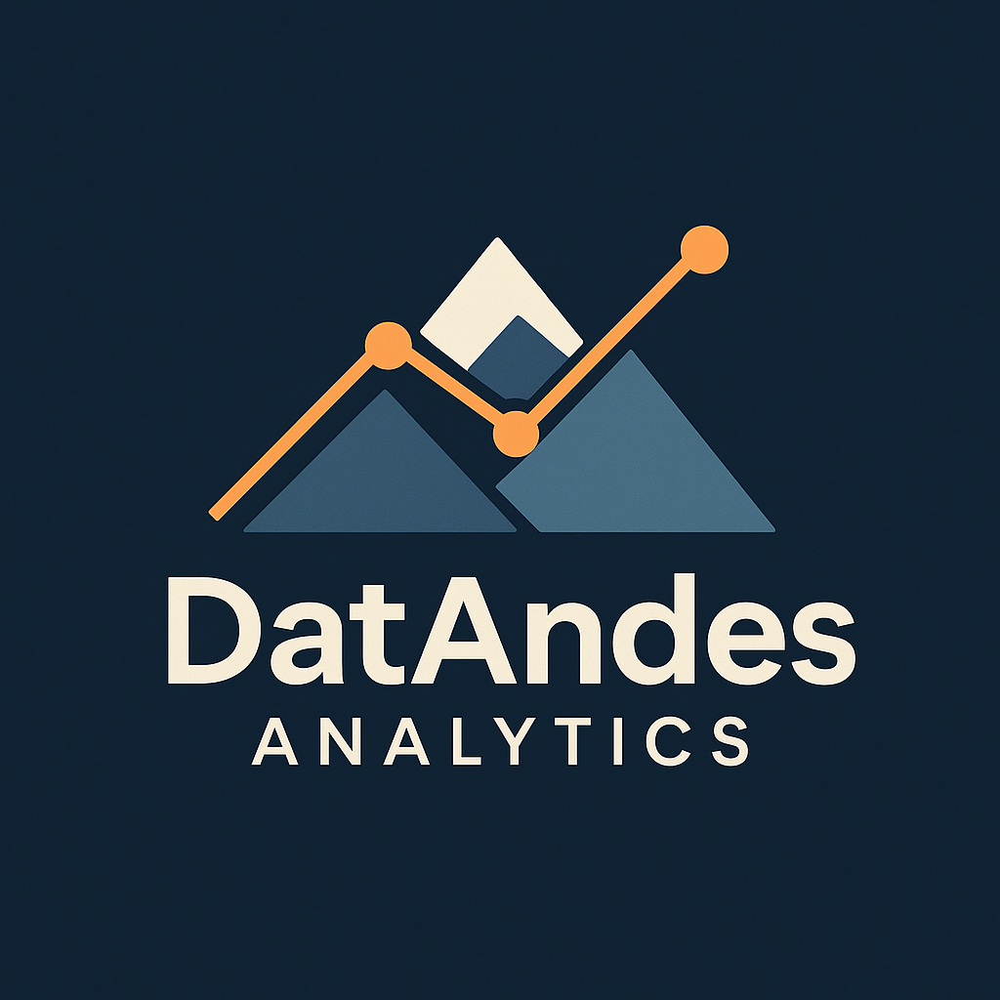

# 🗻 DatAndes Analytics



1. **Misión**: Transformamos datos en decisiones estratégicas para industrias, gobiernos y empresas, usando ciencia de datos con enfoque humano y regional.

2. **Visión**: Ser la firma de análisis de datos líder en Latinoamérica para sectores económicos y sociales, destacándonos por impacto, innovación y ética.

---

## 🦅 Inkadata Economico

*Datos que impulsan decisiones*

**Inkadata Económico** analiza bases de datos del **DANE** y otras **fuentes públicas** para generar **insights** sobre la **economía colombiana**. El proyecto incluye `scraping`, `limpieza`, `visualización` y `conclusiones estadísticas` rigurosas.

---

## 📌 Contenido

- [🗻 DatAndes Analytics](#-datandes-analytics)
  - [🦅 Inkadata Economico](#-inkadata-economico)
  - [📌 Contenido](#-contenido)
  - [👨🏻‍🎓 Licencias](#-licencias)
  - [🏭 Dominio del Proyecto](#-dominio-del-proyecto)
  - [🎯 Objetivos](#-objetivos)
  - [🗂️ Estructura del Proyecto](#️-estructura-del-proyecto)
  - [🚀 Primeros Pasos](#-primeros-pasos)
    - [1. Clona este repositorio](#1-clona-este-repositorio)
    - [2. Crea un entorno virtual e instala las dependencias](#2-crea-un-entorno-virtual-e-instala-las-dependencias)
    - [3. Ejecuta los scripts en orden lógico](#3-ejecuta-los-scripts-en-orden-lógico)
  - [🧠 Tecnologías Utilizadas](#-tecnologías-utilizadas)
  - [Imagen de Tablas Normalizadas](#imagen-de-tablas-normalizadas)
    - [🎨 Paleta de colores DatAndes](#-paleta-de-colores-datandes)
    - [🧑‍🤝‍🧑 Stakeholders del Proyecto](#-stakeholders-del-proyecto)
  - [📬 Contacto](#-contacto)

---

## 👨🏻‍🎓 Licencias

[](LICENSE)
[](https://www.python.org/)
[]()
[]()

---

## 🏭 Dominio del Proyecto

Inkadata Económico se centra en el análisis estructurado de datos económicos oficiales del DANE relacionados con:

- 🔩 Actividad industrial y manufacturera (EAM)
- 🛍️ Comercio y consumo
- 👩‍🏭 Ocupación laboral y género
- 🚚 Importaciones y producción nacional
- 💰 Costos empresariales y variaciones interanuales

>*Todos los análisis son reproducibles, enfocados en comparar evolución económica y generar escenarios interpretables por sector, empresa o interés ciudadano. Las fuentes provienen de microdatos abiertos y están documentadas.*

---

## 🎯 Objetivos

El **objetivo principal** es identificar patrones económicos y contrastar los años **2016**, **2019** y **2022**, generando dashboards y estadísticas que impulsen la toma de decisiones en el contexto macroeconómico colombiano.

---

## 🗂️ Estructura del Proyecto

```bash

```

## 🚀 Primeros Pasos

### 1. Clona este repositorio

```bash
git clone https://github.com/ImCamilo2103/Inkadata.git
cd Inkadata
```

### 2. Crea un entorno virtual e instala las dependencias

```bash
python -m venv venv
source venv/bin/activate  # En Windows: venv\Scripts\activate
pip install -r requirements.txt
```

### 3. Ejecuta los scripts en orden lógico

```bash
python  scripts/01_web_scraping.py
python  scripts/02_ws_archivos_independientes.py
python  scripts/03_extraccion_link_descarga.py
python  scripts/04_descarga_dataset.py
python  scripts/05_descarga_variables_datasets.py
python  scripts/06_Archivo_dicionarios.py
python  scripts/07_validacion-dicionario.py
python  scripts/08_clasificacion_diccionarios.py
sql     scripts/09_creacion_database.sql
python  scripts/10_limpieza_datos_raw.py
python  scripts/11_limpieza _datos.py
python  scripts/12_cargar_datos_dbraw.py
python  scripts/13_crear_tablas.py
python  scripts/14_insert_auxiliares_y_empresas.py
python  scripts/15_insert_3nf.py
python  scripts/16_realizar_consultas.py
R       scripts/17_eda.R
latex   scripts/18_analisis_exploratorio.tex
```
---

## 🧠 Tecnologías Utilizadas

* **Python** 🐍 (Pandas)
* **PostgreSQL** 🐘
* **SQL** para consultas analíticas
* **Git + GitHub** para control de versiones
* **Latex** generar los informes eda
* **Tableau / Power BI** para dashboards

---

## Imagen de Tablas Normalizadas

  
*Modelo relacional en 3NF para almacenar datos.*

---

### 🎨 Paleta de colores DatAndes

- `#1B263B` – Azul oscuro profesional  
- `#415A77` – Azul acero (confianza)  
- `#778DA9` – Gris azulado (respaldo técnico)  
- `#E0E1DD` – Blanco grisáceo (claridad)  
- `#F4A261` – Naranja suave (energía y proactividad)

---

### 🧑‍🤝‍🧑 Stakeholders del Proyecto

- **Usuarios de datos económicos**: periodistas, economistas, estudiantes.
- **Empresas privadas**: análisis sectorial o de mercado.
- **ONGs y centros de investigación**: estudios sobre empleo, informalidad, etc.
- **Ciudadanía curiosa**: personas interesadas en entender su país con datos.

*Nota:* DatAndes es una empresa apolítica. Este proyecto tiene fines educativos y de libre análisis.

---

## 📬 Contacto

Desarrollado por **Camilo Garzón Moreno**  
[](https://www.linkedin.com/in/camilo-garzón-81422331)

---
> *“Los datos son la brújula. Nosotros trazamos el mapa.”*
>> *Inkadata, línea económica de DatAndes Analytics*
